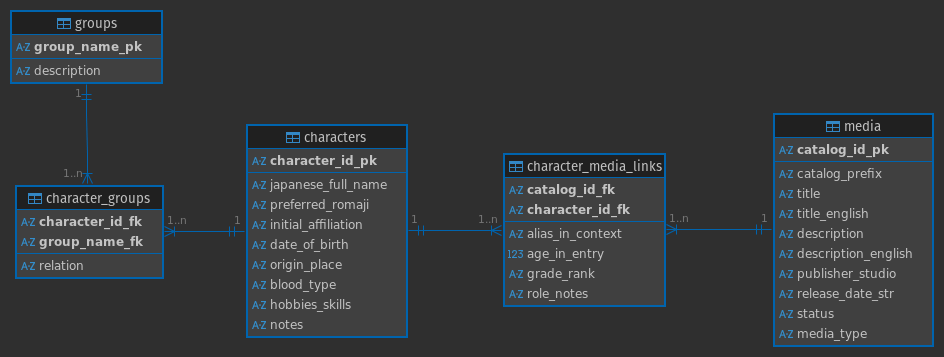

# ContextDB
**A relational knowledge base for AI-assisted media localization.**

## Overview
Large Language Models (LLMs) often struggle with consistency in long-form translation due to limited context windows and other constraints. This results in various issues regarding narrative consistency and situational awareness. This becomes all the more pronounced in highly context-dependent tasks such as translation, where a word or phrase can vary drastically depending upon the specific context and character relationship.

`ContextDB` is a **Structured RAG (Retrieval-Augmented Generation) Backend** designed to help mitigate this. It stores canonical character data, relationships, and temporal changes (e.g., a character aging from 12 to 15) to inject precise context into translation prompts.

## Features
*   **Normalized Schema:** Handles complex entity relationships (Groups, Aliases, Media Links) via SQLite.
*   **LLM-Driven ETL:** Uses **vLLM** and **Pydantic** to parse unstructured HTML/Wiki data into strict SQL entries.
*   **Temporal Context:** Tracks attribute changes (Age, Rank, Affiliation) per Media Entry to ensure narrative consistency.

---

## ⚠️ Data Source Disclaimer
**NOTE: This code will not function as-is.**

This repository contains the **schema design, ETL logic, and LLM extraction pipeline**. It relies on a private dataset of scraped catalog data. Users will need to BYOD (Bring Your Own Data).

To use this pipeline, you must populate the `./data/media` and `./data/characters` directories with your own HTML files, or modify the `process_and_insert` functions in `context.py` to target a public wiki source (e.g., MyAnimeList or AniList).

---

## Architecture
The system utilizes a local LLM server to perform extraction without relying on external APIs.

### 1. Start the LLM Server (vLLM)
This project is optimized for Japanese input data and uses **Elyza-JP-8B** (a Llama-3 derivative tuned for Japanese nuances).

Open a terminal and run the OpenAI-compatible API server:
```bash
python -m vllm.entrypoints.openai.api_server \
    --model elyza/Llama-3-ELYZA-JP-8B
```
*Note: Ensure you have a GPU with sufficient VRAM (approx 16GB for 8B models in FP16).*

### 2. Run the ETL Pipeline
In a separate terminal, run the population script. This will:
1.  Scrape the local HTML files.
2.  Send descriptions to the local vLLM server.
3.  Extract structured metadata (Age, Rank, Groups) using `instructor`.
4.  Populate the SQLite database.

```bash
# Install dependencies
pip install -r requirements.txt

# Run the pipeline
python context.py \
    --media-dir "./data/media" \
    --char-dir "./data/characters" \
    --db-path "context.db"
```

## Schema Snapshot



## Tech Stack
*   **Language:** Python 3.10+
*   **Database:** SQLite
*   **Inference:** vLLM (Local Llama-3)
*   **Validation:** Pydantic + Instructor
